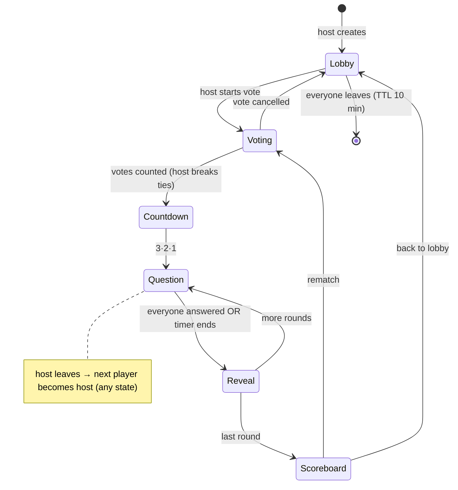
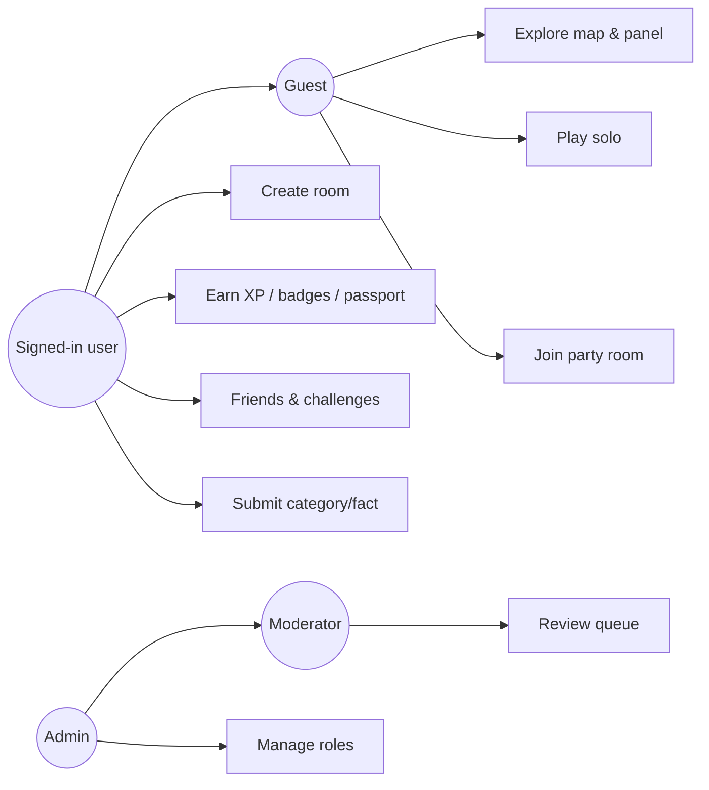

# 3. UML

## 3.1 Domain class diagram

```mermaid
classDiagram
  class Country {
    +code: string  // ISO alpha-2
    +name: string
    +official: string
    +slug: string
    +capital: City
    +region: string
    +subregion: string
    +groups: string[]
    +isUN195: boolean
    +disputed: boolean
    +stats: Map~LayerId, SourcedValue[]~
    +flag: Flag
    +links: OfficialLinks
  }
  class SourcedValue { +v: number|string; +year: int; +src: Source }
  class Source { +id: string; +name: string; +url: string; +license: string }
  class Flag { +svg: string; +colors: Color[]; +meaning: SourcedText }
  class City { +name: string; +lat: number; +lng: number; +population: int; +landmark: boolean }
  class Layer { +id: LayerId; +label: string; +kind: numeric|categorical; +scale: ScaleSpec; +years: int[] }

  class User { +id; +handle; +displayName; +role: player|moderator|admin; +xp; +level; +avatar: AvatarConfig; +countryCode }
  class Guest { +sessionId; +nickname; +avatar: AvatarConfig }
  class AvatarConfig { +body; +eyes; +mouth; +hat; +item }
  class Friendship { +a: User; +b: User; +status: pending|accepted }
  class PassportStamp { +user: User; +country: Country; +tier: bronze|silver|gold; +earnedAt }
  class Badge { +id; +name; +rule }

  class GameConfig { +mode: ModeId; +difficulty: tourist|navigator|cartographer; +scope: Scope; +count: int; +timerSec?: int; +seed: string }
  class Scope { +type: world|continent|subregion|group|custom; +value: string }
  class Question { +id; +mode; +prompt; +answer: AnswerKey; +choices?: string[] }
  class Attempt { +question: Question; +input; +correct: boolean; +points: int; +ms: int }
  class GameSession { +id; +config: GameConfig; +player; +attempts: Attempt[]; +score: int; +ranked: boolean }

  class Room { +code; +hostId; +visibility: public|private; +state: RoomState; +players: Player[]; +settings: GameConfig; +teams? }
  class Player { +id; +nickname; +avatar; +team?; +score; +connected: boolean }
  class Vote { +playerId; +field; +value }
  class ChatMessage { +playerId; +text; +at }

  class Submission { +id; +author: User; +type: category|fact; +payload; +sources: Source[]; +status: pending|approved|rejected; +reviewer? }

  Country "1" --> "1" Flag
  Country "1" --> "*" City
  Country "1" --> "*" SourcedValue
  SourcedValue --> Source
  Layer ..> SourcedValue
  User "1" --> "*" PassportStamp
  User "1" --> "*" GameSession
  User "*" -- "*" User : Friendship
  User "1" --> "*" Badge
  User --> AvatarConfig
  Guest --> AvatarConfig
  GameSession --> GameConfig
  GameConfig --> Scope
  GameSession "1" --> "*" Attempt
  Attempt --> Question
  Room "1" --> "*" Player
  Room --> GameConfig
  Room "1" --> "*" Vote
  Room "1" --> "*" ChatMessage
  Submission --> User
```

## 3.2 Room state machine

```mermaid
stateDiagram-v2
  [*] --> Lobby: host creates
  Lobby --> Voting: host starts vote
  Voting --> Lobby: vote cancelled
  Voting --> Countdown: votes counted (host breaks ties)
  Countdown --> Question: 3·2·1
  Question --> Reveal: everyone answered OR timer ends
  Reveal --> Question: more rounds
  Reveal --> Scoreboard: last round
  Scoreboard --> Voting: rematch
  Scoreboard --> Lobby: back to lobby
  Lobby --> [*]: everyone leaves (TTL 10 min)
  note right of Question: host leaves → next player becomes host (any state)
```

## 3.3 Use-case diagram

```mermaid
flowchart LR
  G((Guest)) --> E1[Explore map & panel]
  G --> E2[Play solo]
  G --> E3[Join party room]
  U((Signed-in user)) --> G
  U --> E4[Create room]
  U --> E5[Earn XP / badges / passport]
  U --> E6[Friends & challenges]
  U --> E7[Submit category/fact]
  M((Moderator)) --> E8[Review queue]
  A((Admin)) --> M
  A --> E9[Manage roles]
```

---
